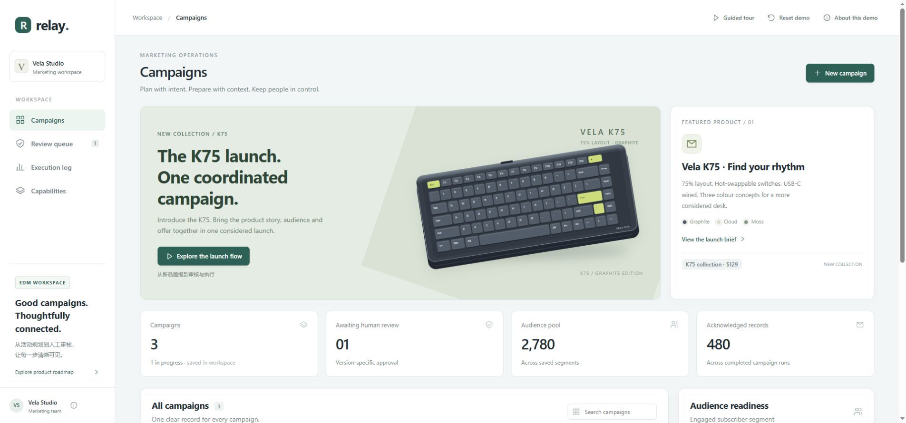
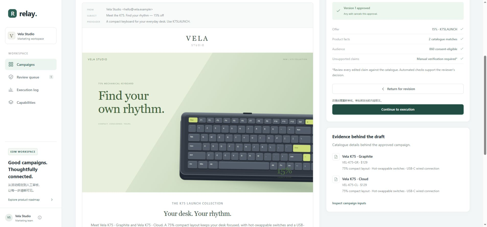
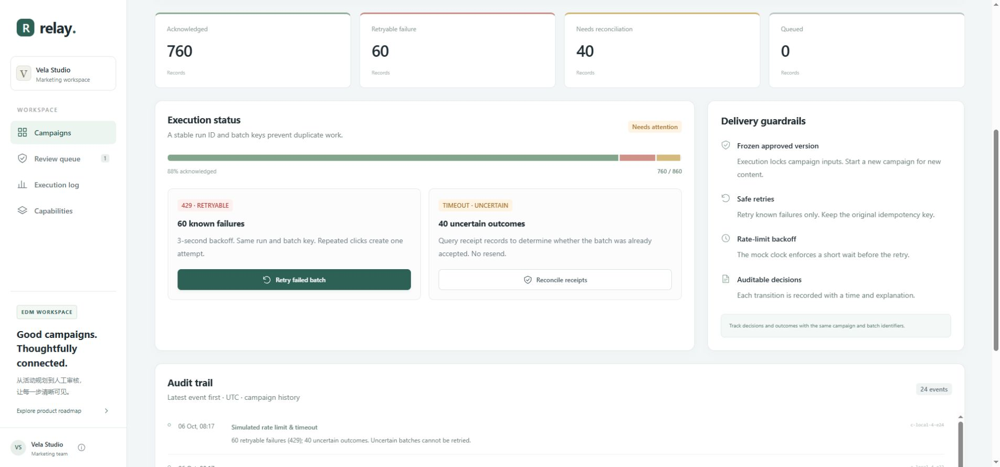
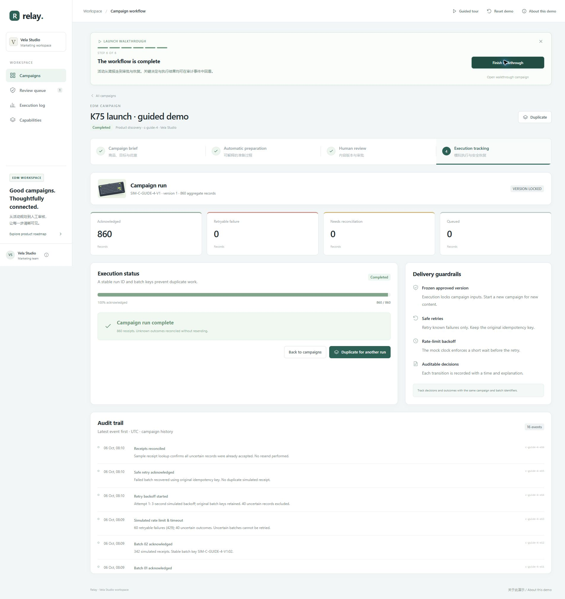
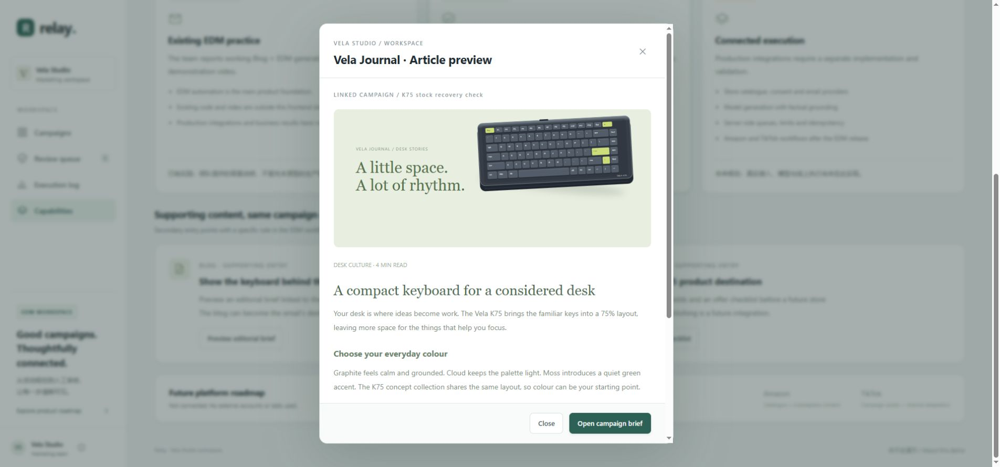
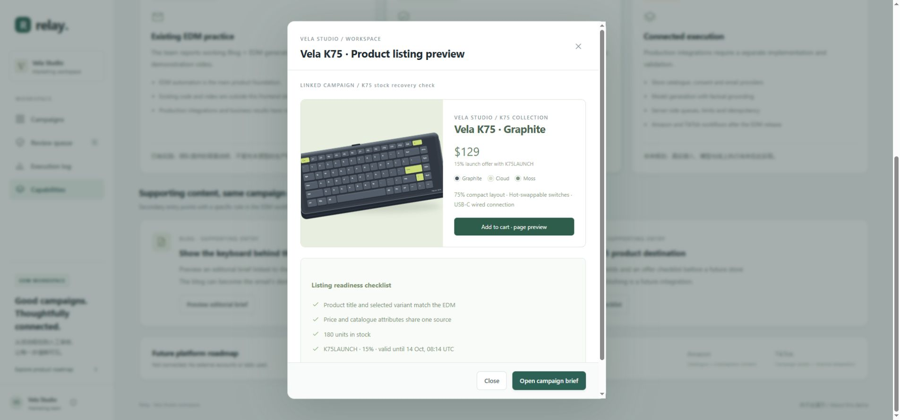
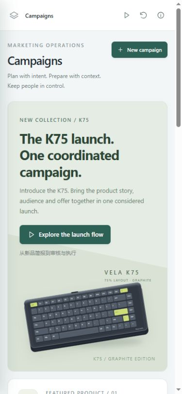
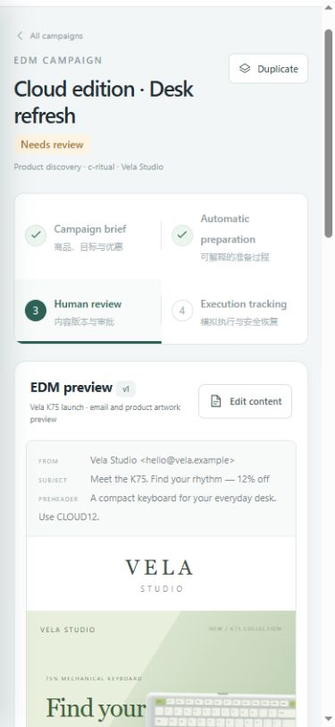

# 实际验证记录

日期：2026-10-06。环境：Windows、Node.js 24.19.0、Chrome、本机回环预览。验证对象为此仓库的前端原型；以下执行数字都是虚构聚合记录，不是生产邮件或送达指标。

## 自动检查

- `npm run check`：`app.js`、`state.js`、`server.mjs` 语法检查通过。
- `npm test`：12 项通过，0 失败。覆盖必填/时间/产品校验、未批准与过期版本门禁、缺货纠正、暂停恢复、改稿撤审及撤销预约、退回后须新版本、防重复、两种恢复顺序、运行身份/游标保存、活动隔离、各人群记录守恒与存储恢复。
- BlogGenerator：Python `ast.parse` 静态语法检查通过。没有导入/执行程序，没有安装其运行依赖，没有下载 embedding，没有调用 Ollama 或其他模型；不宣称 Streamlit/模型运行兼容性已验证。

## 实际浏览器操作

| 场景 | 实际结果 |
|---|---|
| 空白新建与取消 | 空名称提交显示必填错误；取消后没有新增活动 |
| 连续点击创建 | 双击只创建一条 `c-local-4`，没有重复活动 |
| 商品校验 | 加入 Moss 后准备停在 0/4，明确提示缺货；删除 Moss 后可完成 4/4 |
| 准备刷新 | 运行中刷新转为 Preparation paused，Resume 后从保存步骤继续 |
| 批准门禁 | 未批准时 Start campaign run 禁用；勾选事实和人群后才可批准 |
| 改稿撤审 | 修改标题/视觉后从 v1 变 v2，旧批准清除，检查项重置并要求再批准 |
| 退回与返回 | 退回要求说明；保存新稿后才可重批。编辑取消不写入；页面链接可返回总览 |
| 预约取消 | Reserve → Cancel → Reserve，旧内容批准仍有效，事件分开记录 |
| 执行重复点击 | Start 双击只有一次 Simulation started；运行 ID 保持一致 |
| 执行刷新 | 转为 Execution paused，保留原 ID、队列和批次游标，Resume 可完成 |
| 恢复顺序一 | 引导流程：760 确认/60 失败/40 待核对 → 重试后 820/0/40 → 核对后 860/0/0 |
| 恢复顺序二 | 手动新活动：先核对成 800/60/0 → 重试刷新保留 3 秒退避 → 860/0/0 |
| 重试防重复 | Retry 双击只有一次 Retry backoff started；等待期间按钮禁用 |
| 待核对处理 | 沿原回执查回，没有重发未知记录；总数始终为 860 |
| 活动隔离 | 完成测试活动后，原始 launch 仍 Draft，Cloud 仍 Needs review，Welcome 仍原完成样例 |
| 重复与重置 | 两轮键盘完整流程成功；Reset 恢复三个初始活动，刷新后仍一致 |
| 图片与控制台 | 原创本地商品/邮件/Blog/上架图可加载，最终 Chrome error/warn 记录为空 |

前端脚本检查与人工浏览器验证共同提供证据；浏览器操作不是可无人值守重跑的 E2E 测试套件。

## 响应式和可见问题

桌面默认浏览器约 1905 px；手机测试 viewport 390×844 和 375×812（Chrome 内容宽分别为 375 / 360 px）。总览、表单、审核、导航和执行页面完成检查。

最初发现窄屏顶部三个操作按钮超宽、菜单路由后未收起、表格辅助文字造成页面横向滚动。已改为保留可访问名称的图标操作、路由收起菜单、表格滚动范围内定位。复测 `documentElement.scrollWidth === clientWidth`：375/375 和 360/360；商品表单对话框宽 337 px，可以内部滚动并取消；图片均正常加载。活动表格保留自身水平滚动以容纳列。

## 截图证据

这些截图只包含虚构数据和本地界面。已将预览重置到初始总览方便下一次演示。

## 未验证范围

真实独立站、邮件 API、送达/退信、模型质量、服务端一致性、多用户权限和源 EDM 的生产门禁不在本次测试范围。未访问生产服务，未调用模型，未发送邮件。源 EDM 最新知识库只读参考见 [capabilities.md](capabilities.md)。
